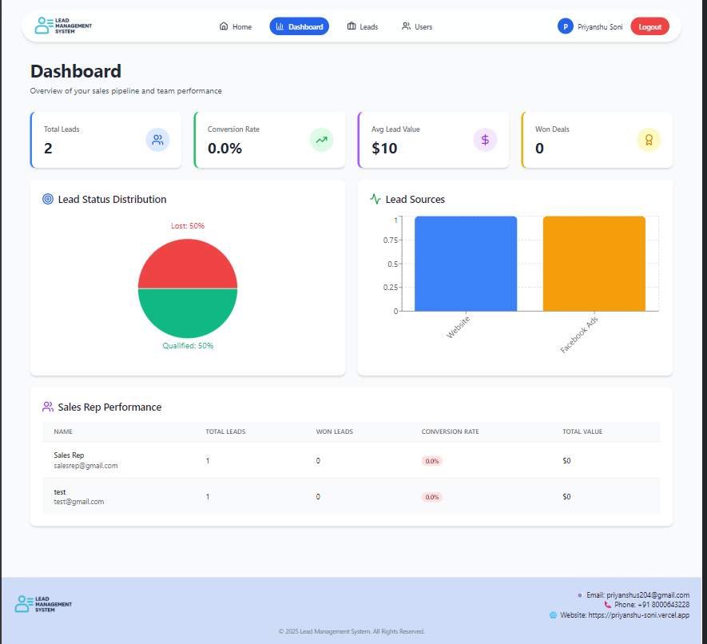
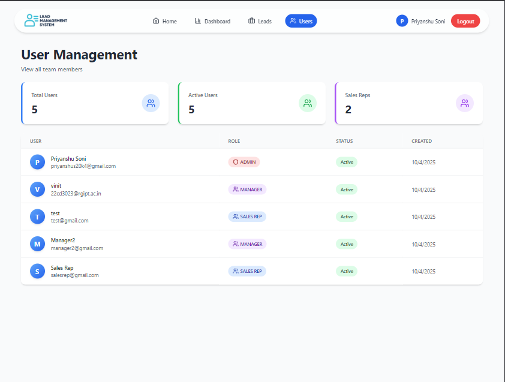

# 🚀 LeadSync CRM - Lead Management System

A comprehensive, full-stack **Customer Relationship Management (CRM)** system designed to streamline lead management, sales tracking, and team collaboration. Built with modern web technologies and best practices.


---

## 📋 Table of Contents

- [Features](#-features)
- [Tech Stack](#-tech-stack)
- [Project Structure](#-project-structure)
- [Prerequisites](#-prerequisites)
- [Installation](#-installation)
- [Configuration](#-configuration)
- [Usage](#-usage)
- [API Documentation](#-api-documentation)
- [User Roles & Permissions](#-user-roles--permissions)
- [Screenshots](#-screenshots)
- [Testing](#-testing)
- [Deployment](#-deployment)
- [Contributing](#-contributing)
- [License](#-license)
- [Contact](#-contact)

---

## ✨ Features

### 🔐 Authentication & Authorization
- Secure JWT-based authentication
- Role-based access control (Admin, Manager, Sales Rep)
- HTTP-only cookie sessions
- Protected routes
- Password encryption with bcrypt

### 📊 Lead Management
- **CRUD Operations**: Create, Read, Update, Delete leads
- **Advanced Filtering**: Filter by status, source, score, value, dates
- **Smart Search**: Real-time search across multiple fields
- **Pagination**: Efficient data loading
- **Lead Assignment**: Assign leads to sales representatives
- **Bulk Operations**: Bulk assign, update, and delete
- **Lead Scoring**: Track and manage lead quality (0-100)
- **Lead Valuation**: Monitor potential revenue

### 📝 Activity Tracking
- Log calls, emails, meetings, and notes
- Visual timeline for each lead
- Track duration and outcomes
- Automatic status change logging
- User attribution for all activities

### 👥 Team Management
- Create and manage sales teams
- Hierarchical structure (Manager → Sales Reps)
- Team-based lead visibility
- Performance tracking per team member

### 📈 Analytics & Reporting
- **Dashboard Overview**: Total leads, conversion rates, average value
- **Visual Charts**: 
  - Lead status distribution (Pie Chart)
  - Lead source distribution (Bar Chart)
  - Sales funnel visualization
- **Performance Metrics**: 
  - Sales rep performance tracking
  - Conversion rate analysis
  - Revenue reporting
- **Recent Activities Feed**: Real-time activity updates

### 👤 User Management
- View all users (Admin/Manager)
- User role and status display
- Active/Inactive user tracking
- Team member overview

### 🎨 Modern UI/UX
- Responsive design (mobile, tablet, desktop)
- Clean and intuitive interface
- Toast notifications
- Loading states and animations
- Modal-based workflows
- Color-coded status indicators

---

## 🛠 Tech Stack

### Backend
- **Runtime**: Node.js (v14+)
- **Framework**: Express.js v5
- **Database**: MongoDB with Mongoose ODM
- **Authentication**: JWT (jsonwebtoken)
- **Password Hashing**: bcrypt
- **Email**: Nodemailer
- **Validation**: Joi
- **Security**: 
  - Helmet (HTTP headers)
  - CORS
  - express-rate-limit
  - cookie-parser

### Frontend
- **Library**: React 18.2
- **Routing**: React Router DOM v6
- **HTTP Client**: Axios
- **State Management**: React Context API
- **Styling**: Tailwind CSS v3
- **UI Components**: 
  - AG Grid (data tables)
  - Recharts (analytics charts)
  - Lucide React (icons)
- **Animations**: tailwindcss-animate

### DevOps & Tools
- **Development**: Nodemon, React Scripts
- **CSS Processing**: PostCSS, Autoprefixer
- **Package Manager**: npm
- **Version Control**: Git

---

## 📁 Project Structure

```
lead-management-system/
├── backend/
│   ├── config/
│   │   ├── db.js                 # MongoDB connection
│   │   └── email.js              # Email configuration
│   ├── middleware/
│   │   └── auth.js               # JWT authentication middleware
│   ├── models/
│   │   ├── Activity.js           # Activity schema
│   │   ├── Lead.js               # Lead schema
│   │   ├── Notification.js       # Notification schema
│   │   ├── Team.js               # Team schema
│   │   └── User.js               # User schema
│   ├── routes/
│   │   ├── activities.js         # Activity endpoints
│   │   ├── analytics.js          # Analytics endpoints
│   │   ├── auth.js               # Authentication endpoints
│   │   ├── leads.js              # Lead management endpoints
│   │   └── teams.js              # Team management endpoints
│   ├── validation/
│   │   └── leadValidation.js     # Input validation
│   ├── .env                      # Environment variables
│   ├── .gitignore
│   ├── package.json
│   └── server.js                 # Express app entry point
│
└── frontend/
    ├── public/
    │   ├── index.html
    │   └── favicon.ico
    ├── src/
    │   ├── api/
    │   │   └── api.js            # Axios instance
    │   ├── assets/
    │   │   ├── logo.png
    │   │   └── hero.png
    │   ├── components/
    │   │   ├── Layout/
    │   │   │   ├── Footer.jsx
    │   │   │   ├── Layout.jsx
    │   │   │   └── Navbar.jsx
    │   │   ├── Lead/
    │   │   │   ├── ActivityTimeline.jsx
    │   │   │   ├── AddActivityModal.jsx
    │   │   │   ├── LeadDetailsModal.jsx
    │   │   │   ├── LeadFilters.jsx
    │   │   │   ├── LeadForm.jsx
    │   │   │   ├── LeadsTable.jsx
    │   │   │   ├── PageHeader.jsx
    │   │   │   ├── PageSizeSelector.jsx
    │   │   │   └── Pagination.jsx
    │   │   └── Route/
    │   │       └── ProtectedRoute.jsx
    │   ├── contexts/
    │   │   ├── AuthContext.jsx   # Global auth state
    │   │   └── NotificationContext.jsx
    │   ├── pages/
    │   │   ├── Dashboard.jsx     # Analytics dashboard
    │   │   ├── Home.jsx          # Landing page
    │   │   ├── Leads.jsx         # Lead management
    │   │   ├── Login.jsx
    │   │   ├── Register.jsx
    │   │   └── Users.jsx         # User management
    │   ├── App.js
    │   ├── index.css
    │   └── index.js
    ├── .env
    ├── .gitignore
    ├── package.json
    ├── postcss.config.js
    └── tailwind.config.js
```

---

## 📦 Prerequisites

Before you begin, ensure you have the following installed:

- **Node.js** (v14 or higher) - [Download](https://nodejs.org/)
- **npm** (v6 or higher) - Comes with Node.js
- **MongoDB** (v4.4 or higher) - [Download](https://www.mongodb.com/try/download/community)
- **Git** - [Download](https://git-scm.com/)

### Verify Installation

```bash
node --version    # Should output v14.x.x or higher
npm --version     # Should output v6.x.x or higher
mongod --version  # Should output MongoDB version
```

---

## 🚀 Installation

### 1. Clone the Repository

```bash
git clone https://github.com/priyanshu08soni/LeadSync.git
cd LeadSync
```

### 2. Backend Setup

```bash
# Navigate to backend directory
cd backend

# Install dependencies
npm install

# Create .env file
cat > .env << 'EOF'
MONGO_URI=mongodb://localhost:27017/lead_management
JWT_SECRET=your_super_secret_jwt_key_change_in_production
PORT=5000
NODE_ENV=development
FRONTEND_ORIGIN=http://localhost:3000
SMTP_HOST=smtp.gmail.com
SMTP_PORT=587
SMTP_SECURE=false
SMTP_USER=your_email@gmail.com
SMTP_PASS=your_app_password
SMTP_FROM=noreply@leadsync.com
EOF

# Start MongoDB (if not running)
mongod

# Start backend server
npm run dev
```

**Backend should be running on:** `http://localhost:5000`

### 3. Frontend Setup

```bash
# Open new terminal and navigate to frontend directory
cd frontend

# Install dependencies
npm install

# Create .env file
cat > .env << 'EOF'
REACT_APP_API_URL=http://localhost:5000/api
EOF

# Start frontend development server
npm start
```

**Frontend should be running on:** `http://localhost:3000`

---

## ⚙️ Configuration

### Backend Environment Variables

Create `backend/.env` file:

```env
# Database
MONGO_URI=mongodb://localhost:27017/lead_management

# JWT Secret (Use strong random string in production)
JWT_SECRET=your_super_secret_jwt_key_change_in_production

# Server
PORT=5000
NODE_ENV=development

# Frontend URL (for CORS)
FRONTEND_ORIGIN=http://localhost:3000

# Email Configuration (SMTP)
SMTP_HOST=smtp.gmail.com
SMTP_PORT=587
SMTP_SECURE=false
SMTP_USER=your_email@gmail.com
SMTP_PASS=your_app_password
SMTP_FROM=noreply@leadsync.com
```

### Frontend Environment Variables

Create `frontend/.env` file:

```env
REACT_APP_API_URL=http://localhost:5000/api
```

### Email Setup (Gmail Example)

1. Go to Google Account settings
2. Enable 2-Factor Authentication
3. Generate an "App Password"
4. Use the app password in `SMTP_PASS`

---

## 📖 Usage

### First-Time Setup

#### 1. Create Admin User (Optional)

Connect to MongoDB and create an admin user:

```javascript
// Using MongoDB shell or Compass
use lead_management;

db.users.insertOne({
  email: "admin@test.com",
  password: "$2b$10$YourHashedPassword", // Use bcrypt to hash
  name: "System Admin",
  role: "admin",
  isActive: true,
  createdAt: new Date(),
  updatedAt: new Date()
});
```

Or use the helper script:

```javascript
// backend/scripts/hashPassword.js
const bcrypt = require('bcrypt');
bcrypt.hash('password123', 10, (err, hash) => {
  console.log('Hashed password:', hash);
});
```

#### 2. Register Users

**Register as Manager:**
1. Navigate to `http://localhost:3000/register`
2. Fill in details:
   - Name: John Manager
   - Email: manager@test.com
   - Password: password123
   - Role: Manager
   - Team Name: Alpha Sales Team
3. Click "Register"

**Register as Sales Rep:**
1. Navigate to `http://localhost:3000/register`
2. Fill in details:
   - Name: Jane Rep
   - Email: rep@test.com
   - Password: password123
   - Role: Sales Rep
   - Select Team: Alpha Sales Team
3. Click "Register"

### Core Workflows

#### Creating a Lead

1. Log in as Manager or Admin
2. Navigate to "Leads" page
3. Click "+ Create" button
4. Fill in lead information:
   - First Name, Last Name, Email (required)
   - Phone, Company, Location
   - Source, Status
   - Score (0-100)
   - Lead Value
   - Assign to Sales Rep
5. Click "Create"

#### Filtering Leads

1. On Leads page, click "Filters" button
2. Use any combination of:
   - Text search
   - Status filter
   - Source filter
   - Score range
   - Value range
   - Date range
3. Filters apply automatically
4. Click "Clear" to reset

#### Logging Activities

1. Click on any lead to view details
2. Switch to "Activities" tab
3. Click "+ Log Activity"
4. Select activity type (Call, Email, Meeting, Note)
5. Enter description
6. For calls/meetings, add duration and outcome
7. Click "Log Activity"

#### Viewing Analytics

1. Navigate to "Dashboard"
2. View:
   - Total leads and conversion rates
   - Lead status distribution (pie chart)
   - Lead source distribution (bar chart)
   - Sales rep performance table
   - Recent activities feed

---

## 📡 API Documentation

### Base URL

```
http://localhost:5000/api
```

### Authentication Endpoints

#### Register User
```http
POST /auth/register
Content-Type: application/json

{
  "name": "John Doe",
  "email": "john@example.com",
  "password": "password123",
  "role": "sales_rep",
  "team": "team_id_here"
}

Response: 201 Created
{
  "user": {
    "_id": "...",
    "name": "John Doe",
    "email": "john@example.com",
    "role": "sales_rep"
  }
}
```

#### Login
```http
POST /auth/login
Content-Type: application/json

{
  "email": "john@example.com",
  "password": "password123"
}

Response: 200 OK
{
  "message": "Logged in",
  "user": { ... }
}
```

#### Get Current User
```http
GET /auth/me
Cookie: token=<jwt_token>

Response: 200 OK
{
  "user": { ... }
}
```

#### Logout
```http
POST /auth/logout

Response: 200 OK
{
  "message": "Logged out"
}
```

### Lead Endpoints

#### Get All Leads (with filtering)
```http
GET /leads?page=1&limit=10&search=john&status=new&score_min=50

Response: 200 OK
{
  "data": [...],
  "page": 1,
  "limit": 10,
  "total": 50,
  "totalPages": 5
}
```

#### Create Lead
```http
POST /leads
Content-Type: application/json

{
  "first_name": "John",
  "last_name": "Doe",
  "email": "john.doe@example.com",
  "phone": "555-1234",
  "company": "Acme Corp",
  "status": "new",
  "source": "website",
  "score": 75,
  "lead_value": 5000,
  "assigned_to": "user_id"
}

Response: 201 Created
```

#### Update Lead
```http
PUT /leads/:id
Content-Type: application/json

{
  "status": "contacted",
  "score": 80
}

Response: 200 OK
```

#### Delete Lead
```http
DELETE /leads/:id

Response: 200 OK
{
  "message": "Deleted"
}
```

#### Assign Lead
```http
PATCH /leads/:id/assign
Content-Type: application/json

{
  "userId": "user_id_here"
}

Response: 200 OK
```

#### Send Email to Lead
```http
POST /leads/:id/send-email
Content-Type: application/json

{
  "subject": "Follow-up",
  "message": "<p>Hello...</p>"
}

Response: 200 OK
```

### Activity Endpoints

#### Log Activity
```http
POST /activities
Content-Type: application/json

{
  "lead_id": "lead_id",
  "type": "call",
  "description": "Discussed requirements",
  "metadata": {
    "duration": 30,
    "outcome": "interested"
  }
}

Response: 201 Created
```

#### Get Lead Activities
```http
GET /activities/lead/:leadId

Response: 200 OK
[
  {
    "_id": "...",
    "type": "call",
    "description": "...",
    "createdAt": "...",
    "user_id": { ... }
  }
]
```

### Analytics Endpoints

#### Get Dashboard Overview
```http
GET /analytics/overview?startDate=2024-01-01&endDate=2024-12-31

Response: 200 OK
{
  "totalLeads": 100,
  "leadsByStatus": [...],
  "leadsBySource": [...],
  "avgLeadValue": 5000,
  "conversionRate": 25.5,
  "recentActivities": [...]
}
```

#### Get Sales Rep Performance
```http
GET /analytics/sales-rep-performance

Response: 200 OK
[
  {
    "_id": "user_id",
    "name": "John Doe",
    "totalLeads": 50,
    "wonLeads": 10,
    "conversionRate": 20,
    "totalValue": 50000
  }
]
```

### Query Parameters for Lead Filtering

| Parameter | Type | Description | Example |
|-----------|------|-------------|---------|
| `search` | string | Text search across fields | `?search=john` |
| `status` | string | Filter by status (comma-separated) | `?status=new,contacted` |
| `source` | string | Filter by source | `?source=website` |
| `score_min` | number | Minimum score | `?score_min=50` |
| `score_max` | number | Maximum score | `?score_max=100` |
| `value_min` | number | Minimum lead value | `?value_min=1000` |
| `value_max` | number | Maximum lead value | `?value_max=10000` |
| `is_qualified` | boolean | Qualified status | `?is_qualified=true` |
| `assigned_to` | string | Filter by assigned user | `?assigned_to=user_id` |
| `unassigned` | boolean | Only unassigned leads | `?unassigned=true` |
| `created_after` | date | Created after date | `?created_after=2024-01-01` |
| `created_before` | date | Created before date | `?created_before=2024-12-31` |
| `page` | number | Page number | `?page=1` |
| `limit` | number | Results per page | `?limit=20` |
| `sortBy` | string | Field to sort by | `?sortBy=createdAt` |
| `sortOrder` | string | Sort order (asc/desc) | `?sortOrder=desc` |

---

## 👥 User Roles & Permissions

### Admin
| Feature | Permission |
|---------|-----------|
| View All Leads | ✅ |
| Create Lead | ✅ |
| Edit Any Lead | ✅ |
| Delete Any Lead | ✅ |
| Assign Leads | ✅ |
| View All Users | ✅ |
| View Analytics | ✅ |
| Log Activities | ✅ |

### Manager
| Feature | Permission |
|---------|-----------|
| View Team Leads | ✅ |
| Create Lead | ✅ |
| Edit Team Leads | ✅ |
| Delete Team Leads | ✅ |
| Assign to Team | ✅ |
| View Team Users | ✅ |
| View Team Analytics | ✅ |
| Log Activities | ✅ |

### Sales Rep
| Feature | Permission |
|---------|-----------|
| View Assigned Leads | ✅ |
| Create Lead | ❌ |
| Edit Own Leads | ✅ |
| Delete Leads | ❌ |
| Assign Leads | ❌ |
| View Users | ❌ |
| View Analytics | ✅ |
| Log Activities | ✅ (own leads) |

---

## 📸 Screenshots

### Dashboard

*Analytics overview with charts and metrics*

### Leads Management

*Advanced filtering and lead listing*

### Lead Details

*Detailed lead information with activity timeline*

---

## 🧪 Testing

### Manual Testing Checklist

#### Authentication
- [ ] Register new user (Manager)
- [ ] Register new user (Sales Rep)
- [ ] Login with valid credentials
- [ ] Login with invalid credentials
- [ ] Logout
- [ ] Access protected routes without auth

#### Lead Management
- [ ] Create new lead
- [ ] View lead list with pagination
- [ ] Search leads by name/email
- [ ] Filter by status
- [ ] Filter by score range
- [ ] Edit lead details
- [ ] Delete lead
- [ ] Assign lead to sales rep

#### Activity Tracking
- [ ] Log call activity
- [ ] Log email activity
- [ ] Log meeting activity
- [ ] Log note
- [ ] View activity timeline
- [ ] Verify timestamps and user attribution

#### Analytics
- [ ] View dashboard statistics
- [ ] Check pie chart rendering
- [ ] Check bar chart rendering
- [ ] View sales rep performance
- [ ] Verify recent activities feed

#### Role-Based Access
- [ ] Admin can access everything
- [ ] Manager can only see team leads
- [ ] Sales Rep can only see assigned leads
- [ ] Unauthorized actions are blocked

### API Testing with cURL

```bash
# Test user registration
curl -X POST http://localhost:5000/api/auth/register \
  -H "Content-Type: application/json" \
  -d '{"name":"Test User","email":"test@test.com","password":"test123","role":"sales_rep","team":"team_id"}'

# Test login
curl -X POST http://localhost:5000/api/auth/login \
  -H "Content-Type: application/json" \
  -c cookies.txt \
  -d '{"email":"test@test.com","password":"test123"}'

# Test getting leads
curl -X GET http://localhost:5000/api/leads \
  -b cookies.txt

# Test creating lead
curl -X POST http://localhost:5000/api/leads \
  -H "Content-Type: application/json" \
  -b cookies.txt \
  -d '{"first_name":"John","last_name":"Doe","email":"john@test.com"}'
```

---

## 🚢 Deployment

### Production Checklist

#### Backend
- [ ] Set `NODE_ENV=production`
- [ ] Use strong `JWT_SECRET` (min 32 characters)
- [ ] Configure production MongoDB URI
- [ ] Set up SMTP with production credentials
- [ ] Enable HTTPS
- [ ] Set secure cookies (`secure: true`)
- [ ] Configure CORS for production domain
- [ ] Add rate limiting
- [ ] Set up logging (Winston, Morgan)
- [ ] Configure environment variables
- [ ] Set up process manager (PM2)

#### Frontend
- [ ] Build production bundle: `npm run build`
- [ ] Update API URL to production backend
- [ ] Configure CDN for static assets
- [ ] Enable service workers
- [ ] Optimize images
- [ ] Add error boundaries
- [ ] Configure analytics (Google Analytics, etc.)

### Deploy to Heroku (Example)

#### Backend

```bash
# Install Heroku CLI
brew install heroku/brew/heroku  # macOS
# or download from https://devcenter.heroku.com/articles/heroku-cli

# Login to Heroku
heroku login

# Create Heroku app
cd backend
heroku create your-app-name-backend

# Add MongoDB addon
heroku addons:create mongolab

# Set environment variables
heroku config:set JWT_SECRET=your_production_secret
heroku config:set FRONTEND_ORIGIN=https://your-frontend-domain.com
heroku config:set NODE_ENV=production

# Deploy
git push heroku main

# View logs
heroku logs --tail
```

#### Frontend (Netlify)

```bash
# Build production bundle
cd frontend
npm run build

# Deploy to Netlify
# Option 1: Drag and drop 'build' folder to Netlify dashboard
# Option 2: Use Netlify CLI
npm install -g netlify-cli
netlify deploy --prod --dir=build
```

### Deploy to Railway (Recommended)

#### Backend
1. Go to [Railway](https://railway.app/)
2. Click "New Project" → "Deploy from GitHub repo"
3. Select your repository
4. Set root directory to `backend`
5. Add environment variables in Railway dashboard
6. Deploy automatically on push

#### Frontend (Vercel)
1. Go to [Vercel](https://vercel.com/)
2. Click "New Project" → Import from GitHub
3. Set root directory to `frontend`
4. Add environment variable: `REACT_APP_API_URL`
5. Deploy

---

## 🤝 Contributing

Contributions are welcome! Please follow these steps:

1. **Fork the repository**
   ```bash
   gh repo fork priyanshu08soni/LeadSync
   ```

2. **Create a feature branch**
   ```bash
   git checkout -b feature/AmazingFeature
   ```

3. **Make your changes**
   - Write clean, documented code
   - Follow existing code style
   - Add comments where necessary

4. **Commit your changes**
   ```bash
   git commit -m 'Add some AmazingFeature'
   ```

5. **Push to the branch**
   ```bash
   git push origin feature/AmazingFeature
   ```

6. **Open a Pull Request**
   - Provide a clear description of changes
   - Reference any related issues
   - Wait for code review

### Code Style Guidelines

- Use ESLint and Prettier
- Follow React best practices
- Write meaningful variable names
- Add JSDoc comments for functions
- Keep components small and focused
- Use React hooks properly
- Handle errors gracefully

---

## 📄 License

This project is licensed under the MIT License - see the [LICENSE](LICENSE) file for details.

```
MIT License

Copyright (c) 2024 LeadSync CRM

Permission is hereby granted, free of charge, to any person obtaining a copy
of this software and associated documentation files (the "Software"), to deal
in the Software without restriction, including without limitation the rights
to use, copy, modify, merge, publish, distribute, sublicense, and/or sell
copies of the Software, and to permit persons to whom the Software is
furnished to do so, subject to the following conditions:

The above copyright notice and this permission notice shall be included in all
copies or substantial portions of the Software.

THE SOFTWARE IS PROVIDED "AS IS", WITHOUT WARRANTY OF ANY KIND, EXPRESS OR
IMPLIED, INCLUDING BUT NOT LIMITED TO THE WARRANTIES OF MERCHANTABILITY,
FITNESS FOR A PARTICULAR PURPOSE AND NONINFRINGEMENT. IN NO EVENT SHALL THE
AUTHORS OR COPYRIGHT HOLDERS BE LIABLE FOR ANY CLAIM, DAMAGES OR OTHER
LIABILITY, WHETHER IN AN ACTION OF CONTRACT, TORT OR OTHERWISE, ARISING FROM,
OUT OF OR IN CONNECTION WITH THE SOFTWARE OR THE USE OR OTHER DEALINGS IN THE
SOFTWARE.
```

---

## 📞 Contact

**Project Maintainer:** Priyanshu Soni

- 📧 Email: priyanshus20k4@gmail.com
- 📱 Phone: +91 8000643228
- 🌐 Website: [https://priyanshu-soni.vercel.app](https://priyanshu-soni.vercel.app)
- 💼 GitHub: [@priyanshusoni](https://github.com/priyanshu08soni)

**Project Link:** [https://github.com/priyanshu08soni/LeadSync](https://github.com/priyanshu08soni/LeadSync)

---

## 🙏 Acknowledgments

- [React Documentation](https://react.dev/)
- [Express.js Guide](https://expressjs.com/)
- [MongoDB Manual](https://docs.mongodb.com/)
- [Tailwind CSS](https://tailwindcss.com/)
- [AG Grid](https://www.ag-grid.com/)
- [Recharts](https://recharts.org/)
- [Lucide Icons](https://lucide.dev/)

---

## 🗺️ Roadmap

### Upcoming Features

- [ ] **Real-time Notifications**: WebSocket-based live updates
- [ ] **Email Templates**: Pre-built templates for common communications
- [ ] **CSV Import/Export**: Bulk lead import and export
- [ ] **Advanced Reporting**: Custom reports with date ranges
- [ ] **Calendar Integration**: Sync meetings with Google Calendar
- [ ] **Mobile App**: React Native mobile application
- [ ] **Dark Mode**: Theme switching capability
- [ ] **Multi-language Support**: i18n implementation
- [ ] **Two-Factor Authentication**: Enhanced security
- [ ] **Lead Scoring Automation**: AI-based scoring
- [ ] **Custom Fields**: User-defined lead fields
- [ ] **Webhooks**: Integration with external services
- [ ] **API Rate Limiting**: Enhanced security
- [ ] **Audit Logs**: Complete activity tracking
- [ ] **File Attachments**: Upload documents per lead

### Version History

- **v1.0.0** (Current)
  - Initial release
  - Core CRM functionality
  - Activity tracking
  - Analytics dashboard
  - Role-based access control

---

## 💡 Tips & Best Practices

### For Developers

1. **Always use environment variables** for sensitive data
2. **Validate all inputs** on both frontend and backend
3. **Handle errors gracefully** with try-catch blocks
4. **Use React Context** for global state management
5. **Implement proper loading states** for better UX
6. **Write reusable components** to avoid code duplication
7. **Comment complex logic** for future maintainability
8. **Test on multiple browsers** before deployment
9. **Optimize images** and assets for performance
10. **Use Git branches** for feature development

### For Users

1. **Regularly update lead status** for accurate reporting
2. **Log all customer interactions** for better tracking
3. **Use filters** to quickly find specific leads
4. **Assign leads promptly** to sales reps
5. **Monitor the dashboard** for performance insights
6. **Keep lead information up-to-date**
7. **Use descriptive activity notes**
8. **Review analytics weekly** for trends
9. **Follow up on high-score leads** first
10. **Maintain clean data** by removing duplicates

---
